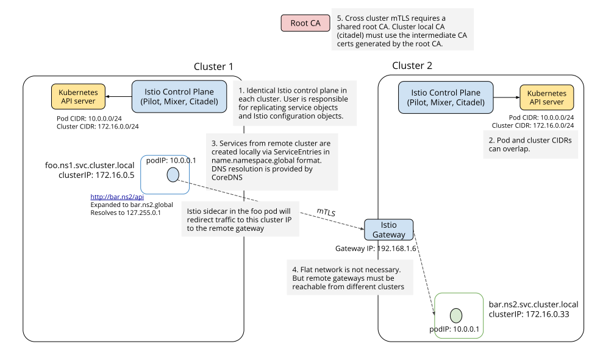
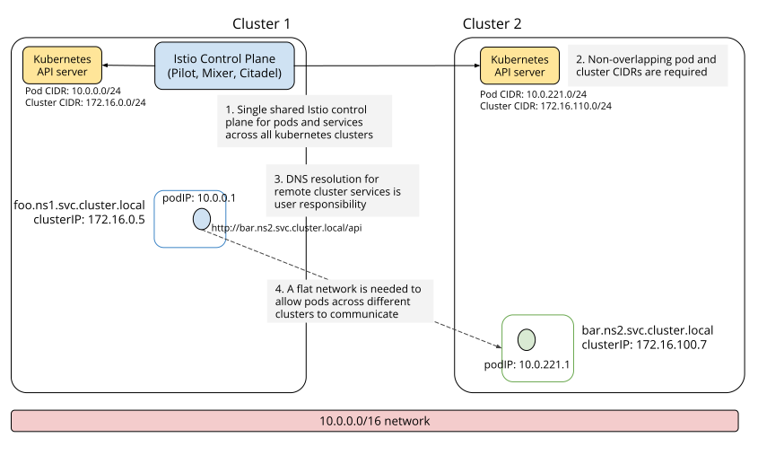
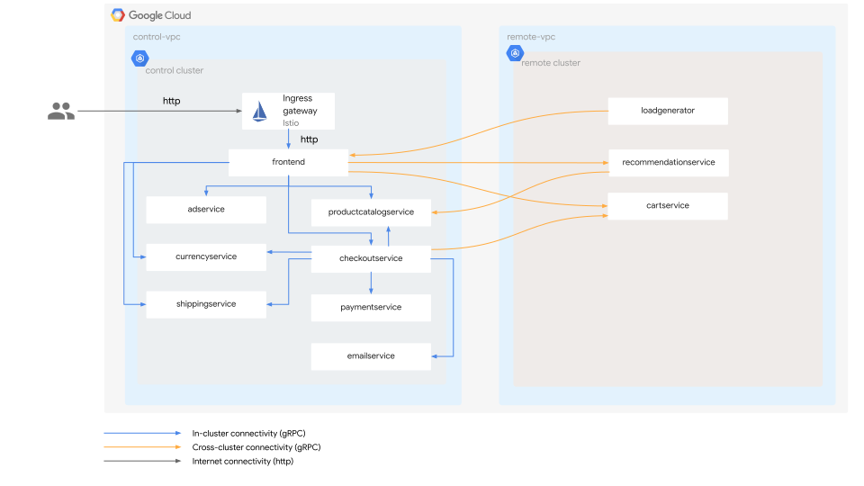

# Istio: Multiluster Configuration

## Summary

### Spanning Istio Mesh

Istio Version: `1.7.x`

Supported k8s versions: `1.16`, `1.17` and `1.18`

* Replicated control planes
* Shared control plane
  * Single(Flat) network
  * Multiple networks

---

* Replicated control planes

> * Clusters must have `istio-ingressgateway` services which are accessible from every other cluster.
> * A __Root CA__ to enable mutual TLS connection across clusters.
>   (Istio CA of each clusters will be an intermediate CA cert. generated by a shared root CA.)



* Shared control plane

> * All control planes must be routable to each other.
> * Each cluster Pod CIDR ranges must be unique across the network and do not overlap.
> * __Clusters on different networks must have `istio-ingressgateway` services which are accessible from every other cluster.__
> * A __Root CA__ to enable mutual TLS connection across clusters.  
>   (Istio CA of each clusters will be an intermediate CA cert. generated by a shared root CA.)




---

* `kubectl -n istio-system secrets cacerts`:

```yaml
apiVersion: v1
kind: Secret
metadata:
  name: cacerts
  namespace: istio-system
type: Opaque
stringData:
  root-cert.pem: ...
  ca-cert.pem: ...
  ca-key.pem: ...
  cert-chain.pem: ...
```

or 

```sh
kubectl create namespace istio-system && \
kubectl -n istio-system create secret generic cacerts \
  --from-file=samples/certs/ca-cert.pem \
  --from-file=samples/certs/ca-key.pem \
  --from-file=samples/certs/root-cert.pem \
  --from-file=samples/certs/cert-chain.pem
```

## References

* [Istio: Multicluster Installation](https://istio.io/v1.7/docs/setup/install/multicluster/)
* [GCP: Building a GKE multi-cluster service mesh with Istio: Shared control plane across disparate networks](https://cloud.google.com/architecture/building-gke-multi-cluster-service-mesh-with-istio-shared-control-plane-disparate-networks)
